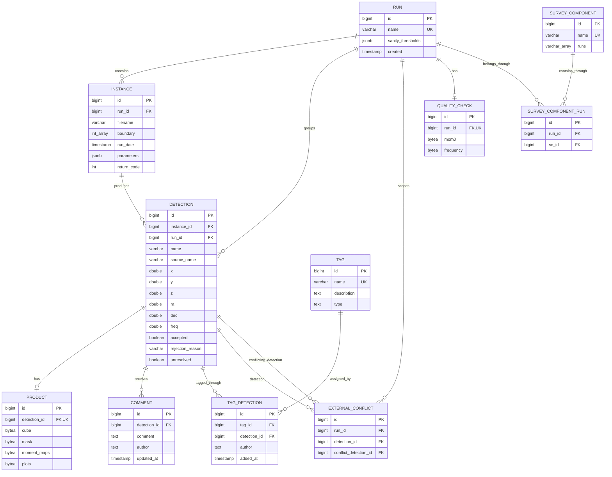
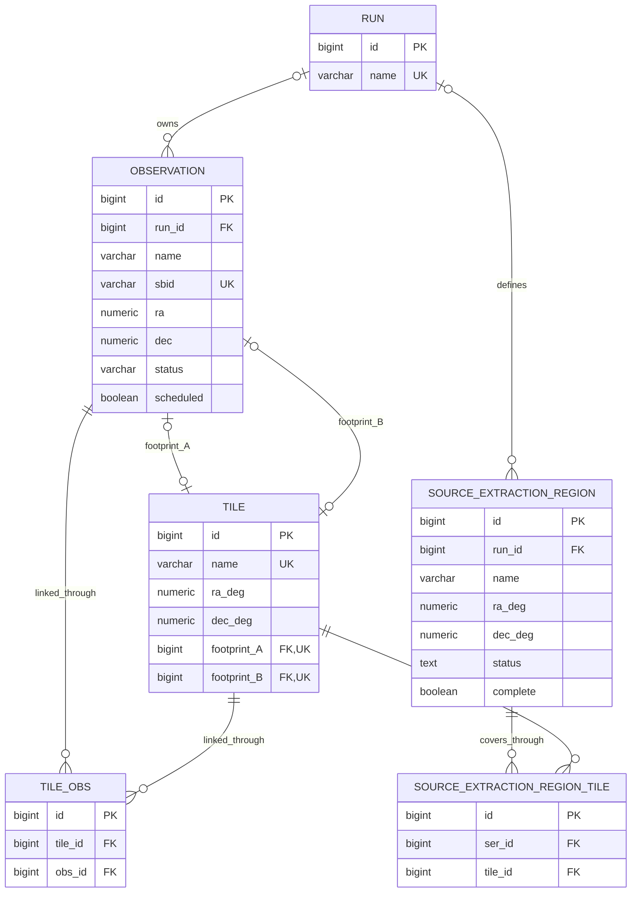
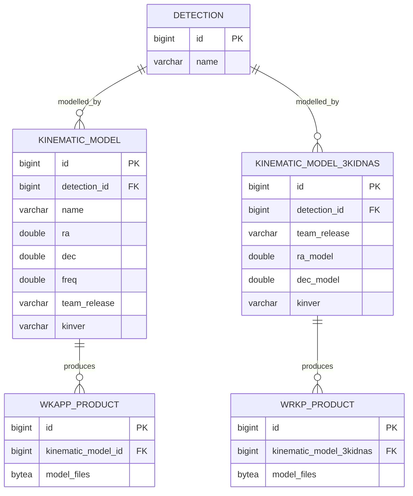

# Database schema

** This doc is AI generatad. Correctness was not verified.

This project uses PostgreSQL database `wallabydb` and schema `wallaby`. The
diagram is derived from the foreign keys in `db/02-tables.sql` and
`db/04-kinematics.sql`; it describes the schema created by the repository, not
the contents of a particular running database.

## Entity relationship diagram

### Manual inspection state

The `accepted` and nullable `rejection_reason` columns together represent
the current manual inspection outcome:

| Outcome | `accepted` | `rejection_reason` |
| --- | --- | --- |
| Accept | `true` | `NULL` |
| Reject | `false` | `noise` |
| RFI | `false` | `rfi` |
| Pending or legacy unclassified | `false` | `NULL` |

Historical `accepted=false` rows are not backfilled because the old schema
did not distinguish an uninspected detection from an old rejection. Only
non-null rejection reasons written by the new workflow are classified
rejections.

## Observation and scheduling relationships

## Kinematic catalogue relationships

## Standalone table

`task` is an operational job table with no declared foreign keys. It stores a
function name, JSON arguments/queryset/result, timestamps, state, error, and
user. PostgreSQL extensions `postgis` and `pg_sphere` are also enabled but do
not add project-owned entities to this diagram.

## Reading the cardinality

- `||` means exactly one, `o|` means zero or one, and `o{` means zero or many.
- `PRODUCT` and `QUALITY_CHECK` are optional one-to-one relations because their
  foreign keys are unique.
- `TAG_DETECTION`, `TILE_OBS`, `SURVEY_COMPONENT_RUN`, and
  `SOURCE_EXTRACTION_REGION_TILE` are association tables implementing
  many-to-many relationships.
- Deleting a run cascades to instances, detections, conflicts, quality checks,
  and survey-component links. Observation links use `SET NULL`; scheduling
  region/tile links use `NO ACTION`.
